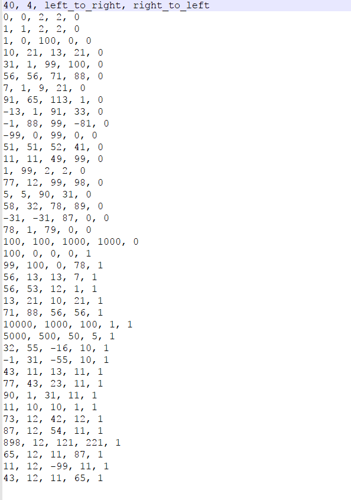
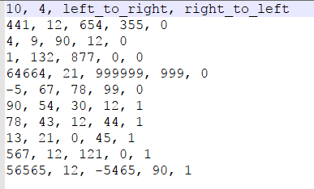
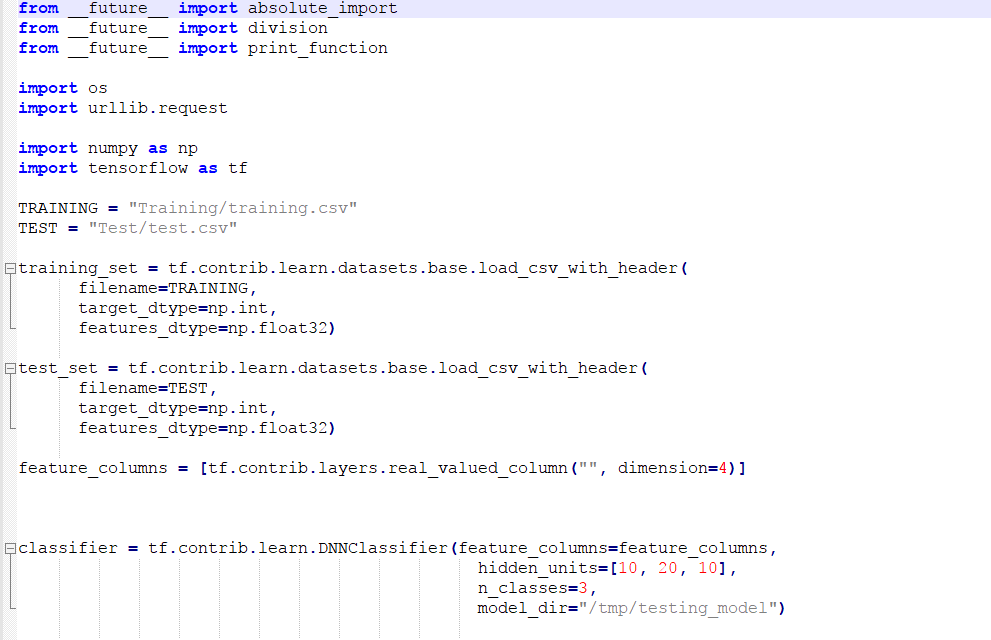
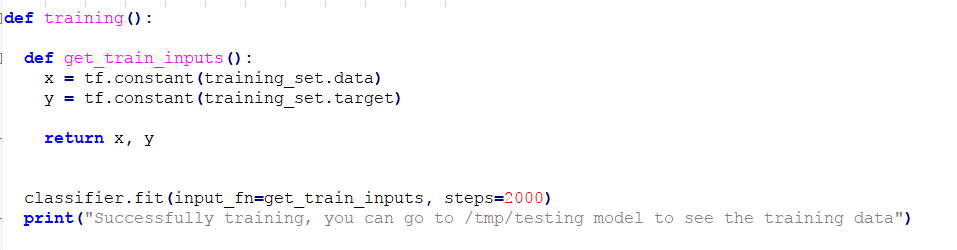
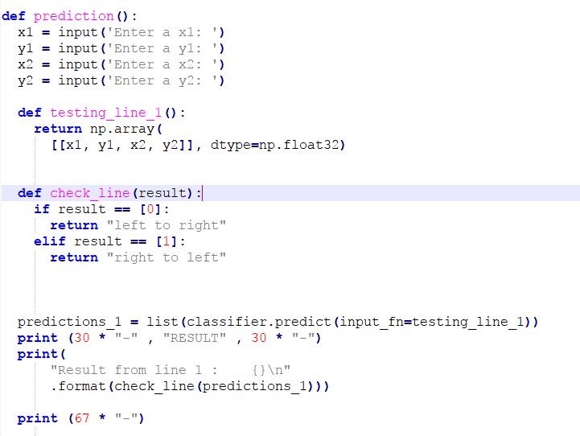
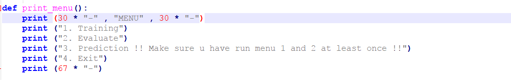
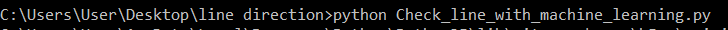
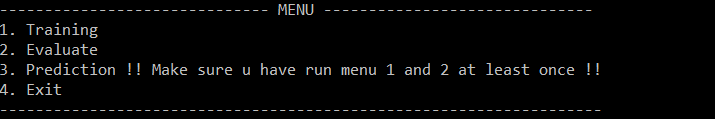

# Machine Learning Introduction: my kind of Hello world to ML
Using machine learning to predict the direction of a line using a simple model

This is just something that i done for learning and fun.
it kinda of my "hello world" to machine learning.
This code is to learn how to use tensorflow to build a machine learning model
and training / evaluate the model.
For this, i using supervised learning to develop the model

image 1 show the training data set start from second line that are provided for this model and image 2
show the evaluation data for evaluate the model in later process.
this data have 5 column where the first 4 column is for feature data while the last column is for 
expected output for the training data where "0" is for output 1 while "1" for output 2
the data structure use for learning is in form of {x1,y1,x2,y2}
to show the first point location and the second point location to learn the direction movement
of the straight line.
 

image 1
 

---

image 2
 

---

image 3 show all the library needed for this code
and the model that will be used.
for this model, it will use 4 feature to learning
3 hidden layer with 10,20,10 number of node respectively.
 

image 3
 

---

image 4 show the code for training the model
the training use 2000 step to learn the data provided.
 

image 4
 

---

image 5 show the evaluation process by using the data for evaluate
it is important to make sure that the data use in evaluation process is different
from training process data to avoid from over fitting the model
over fitting is where the training model will only good in predicting the data in training 
process only and not general.
 

image 5
 

---

image 6 show the input taken for prediction and the code for making a prediction using the train 
model.
 

image 6
 

---

image 7 show the menu available for this code
 

image 7
 

---

image 8 show how to run this code in cmd and will give a menu available like in image 9
 

image 8
 

---

 

image 9
 

---

