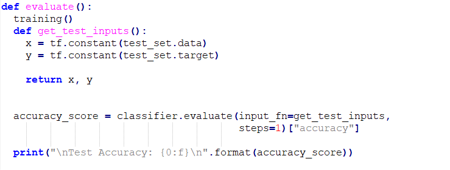

# Machine Learning Introduction: my kind of Hello world to ML
Using machine learning to predict the direction of a line using a simple model

This is just something that i done for learning and fun.
it kinda of my "hello world" to machine learning.

image 1

---

image 2

---

image 3

---

image 4

---

image 5

---

image 6

---

image 7

---

image 8

---

image 9

---

